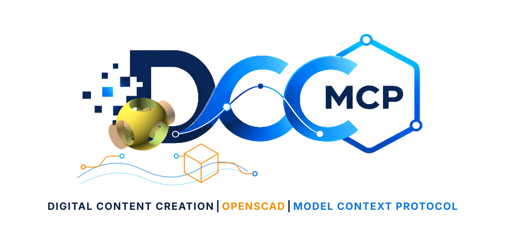
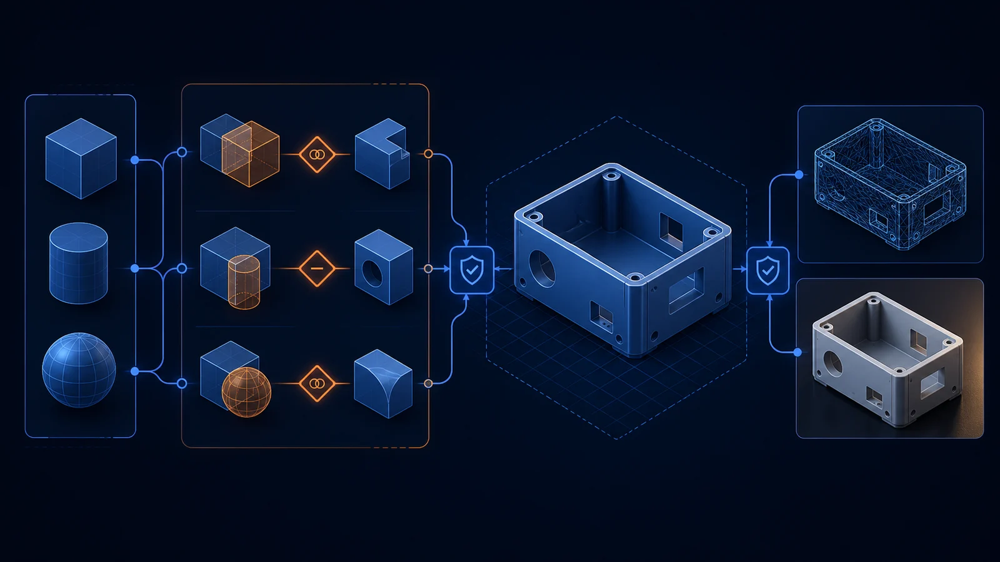

# dcc-mcp-openscad

<p align="center">
  
</p>

Production OpenSCAD adapter for deterministic model inspection, validation,
geometry export, and PNG rendering through DCC-MCP.



_Illustrative workflow based on the live OpenSCAD → FreeCAD → Blender/Godot acceptance run; generated source is retained in `docs/images/dcc-mcp-openscad-showcase-source.png`._

<!-- dcc-mcp-coverage-pointer:start -->
<!-- Generated from dcc-mcp-catalog.yml by scripts/generate_adapter_pointer.py in dcc-mcp/dcc-mcp-core. Do not edit by hand. -->
## Part of the DCC-MCP host matrix

**dcc-mcp-openscad** — OpenSCAD adapter for deterministic model validation, export, and
rendering.

It is one of **38 host adapters** in the DCC-MCP catalog. Every adapter speaks the same
MCP protocol and builds on the same core runtime contract; each one exposes the tools
its own host needs on top of that.

- [All host adapters and install metadata](https://dcc-mcp.github.io/ecosystem)
- [Host matrix on the core README](https://github.com/dcc-mcp/dcc-mcp-core#readme)
- [Showcase](https://dcc-mcp.github.io/showcase)

This block is generated from the catalog entry in
[`dcc-mcp-catalog.yml`](https://github.com/dcc-mcp/dcc-mcp-core/blob/main/dcc-mcp-catalog.yml).
Re-run the generator after changing the catalog.
<!-- dcc-mcp-coverage-pointer:end -->

## Capabilities

- Detect the standalone OpenSCAD CLI and report version-specific capabilities.
- Inspect modules, functions, variables, and `include`/`use` references without
  executing source.
- Validate a parameterized model with structured warning/error diagnostics.
- Export STL (explicit binary or ASCII), 3MF, AMF, OFF, CSG, DXF, SVG, PDF,
  and OpenSCAD diagnostic formats.
- Render bounded PNG previews or full geometry renders with typed camera,
  projection, color-scheme, size, and parameter inputs.
- Stage outputs atomically, read the artifact back to prove the write landed,
  and return file size plus SHA-256 provenance.

The adapter does not accept arbitrary OpenSCAD command-line arguments or raw
`-D` expressions. JSON scalar/array parameters are encoded by the adapter.

## Requirements

- Python 3.7+
- `dcc-mcp-core` 0.20.36+
- OpenSCAD inside the verified compatibility matrix

Supported ranges are declared in `compat_matrix.json` and enforced before any
tool runs: OpenSCAD `2021.01.x` and `2026.09.x`. A host outside the matrix is
refused with an explicit error code rather than run unverified, and
`dcc-mcp-openscad doctor --json` always reports the version it found together
with that verdict.

On Windows, point to `openscad.com` when possible; if `openscad.exe` is
configured and a sibling `openscad.com` exists, the adapter selects the console
launcher automatically.

## Runtime boundary

OpenSCAD is not a Python host and has no embedded interpreter for the adapter
to run inside. The adapter is a Python process that supervises an `openscad`
CLI child process:

```text
host side (this adapter)               OpenSCAD side (child process)
-----------------------------------    ---------------------------------
external Python 3.7+                   `openscad` CLI executable
dcc_mcp_openscad.bridge                --version / --help probes
dcc_mcp_openscad._process              one supervised process tree per call,
                                       bounded by a single absolute deadline
dcc_mcp_openscad._probe_supervisor     owning the child's stdout/stderr files
```

What follows from that boundary:

- The Python version that matters is the host-side one that owns the wheel.
  There is no second interpreter, so there is no host/embedded version mismatch
  to diagnose.
- Every CLI call is a fresh process with a bounded deadline: no persistent
  session, no in-process state, no shared memory.
- Arguments cross the boundary as an argument vector, never through a shell, so
  a model path or parameter is never interpreted as shell syntax.
- Results come back as files plus bounded captured output, and a mutating tool
  re-reads the artifact to prove the write landed (see
  [`docs/write-contract.md`](docs/write-contract.md)).

## Install

See [`install.md`](install.md) for wheel-only setup, platform discovery, the
official six-verb Install SOP lifecycle, ownership receipts, rollback, and
troubleshooting.

```bash
python -m pip install dcc-mcp-openscad
dcc-mcp-openscad doctor --json
dcc-mcp-openscad install --yes --json
dcc-mcp-openscad
```

For an explicit standalone readiness check:

```powershell
dcc-mcp-openscad verify --executable "C:\Program Files\OpenSCAD\openscad.com" --json
```

For development:

```bash
python -m pip install -e ".[dev]"
python -m pytest
```

## Configuration

| Variable | Purpose | Default |
| --- | --- | --- |
| `DCC_MCP_OPENSCAD_EXECUTABLE` | Exact OpenSCAD executable or install directory | `PATH` and standard install locations |
| `DCC_MCP_OPENSCAD_ALLOWED_ROOTS` | `os.pathsep`-separated source/output roots | server working directory |
| `DCC_MCP_OPENSCAD_MAX_SOURCE_BYTES` | Maximum source size | 4 MiB |
| `DCC_MCP_OPENSCAD_MAX_TIMEOUT_SECS` | Maximum per-call deadline | 1800 seconds |
| `DCC_MCP_OPENSCAD_PORT` | Fixed adapter port when direct addressing is required | OS-assigned |

The service registers as a standalone DCC-MCP instance. It has no bound GUI
PID and needs no OpenSCAD window.

## Agent workflow

Use the standard discovery path:

```bash
dcc-mcp-cli list
dcc-mcp-cli search --query "OpenSCAD validate export STL"
dcc-mcp-cli load-skill openscad-pipeline --dcc-type openscad --instance-id <instance-short>
dcc-mcp-cli describe openscad.<instance-short>.openscad_pipeline__validate_model
```

Then call `inspect_source` → `validate_model` → `export_model` or
`render_preview`. Long calls are asynchronous and should be polled through the
core job tools returned by the call.

`examples/production_smoke.scad` is a parameterized enclosure used by the live
acceptance test. Override `width`, `depth`, `height`, `wall`, `corner_radius`,
or `vent_count` to verify safe parameter encoding and reproducible artifacts.

## Safety contract

- Source and output paths must remain under configured allowed roots.
- Existing outputs are never replaced unless `overwrite=true` is explicit.
- Exports use sibling temporary files and become visible only after success.
- A mutating tool returns only after re-reading the artifact and proving the
  write landed; a mismatch is an explicit error naming the expected and actual
  values instead of a reported success.
- Parameter names, values, nesting, count, image dimensions, formats, and
  deadlines are bounded.
- Cancellation and timeouts terminate the owned OpenSCAD child process.
- Captured process output is limited to 64 KiB per stream.

## Verification

CI installs a real OpenSCAD for every supported range -- each binary pinned by
version and SHA-256 -- and runs the end-to-end case that validates, exports
STL, and renders PNG. The job fails if that case is skipped, so a missing host
cannot look like a pass. See [`install.md`](install.md) for the ranges and the
error codes.

OpenSCAD CLI reference:
<https://en.wikibooks.org/wiki/OpenSCAD_User_Manual/Using_OpenSCAD_in_a_command_line_environment>
